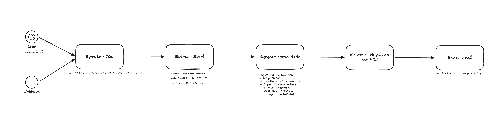

# Analisis funcional Reporte consolidado de cargadores

## Pasos
1. Extraer tickets a partir de JQL
2. Tomar los customfields 'Cargador Tesoreria' y 'Cargador Contabilidad' de los tickets filtrados
3. Consolidar estos dataframes en 3 pestañas en un solo archivo
4. Generar un link
5. Enviar por correo.
6. En casos no exista data, notificar de todos modos que no hay información.
## Flujo funcional
